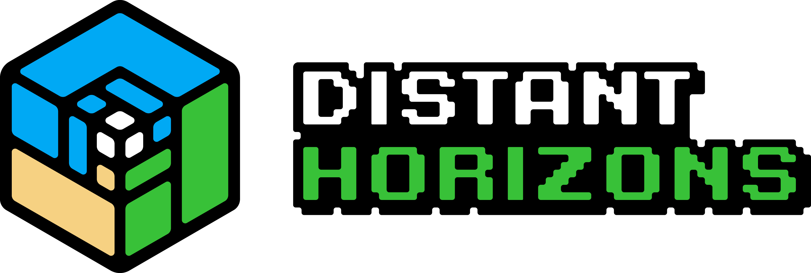
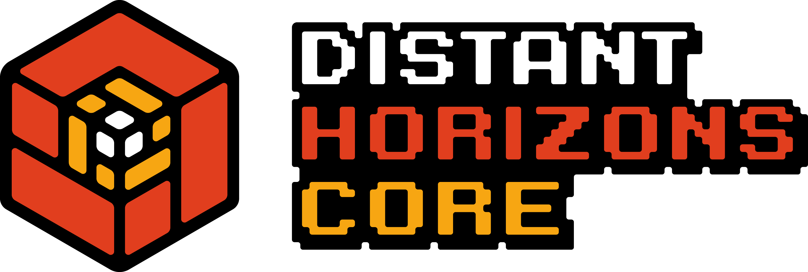
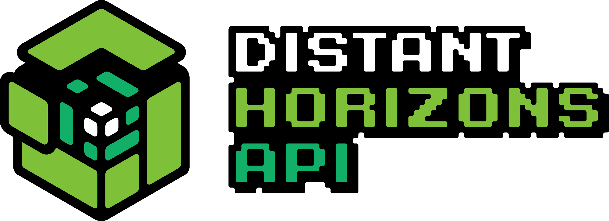
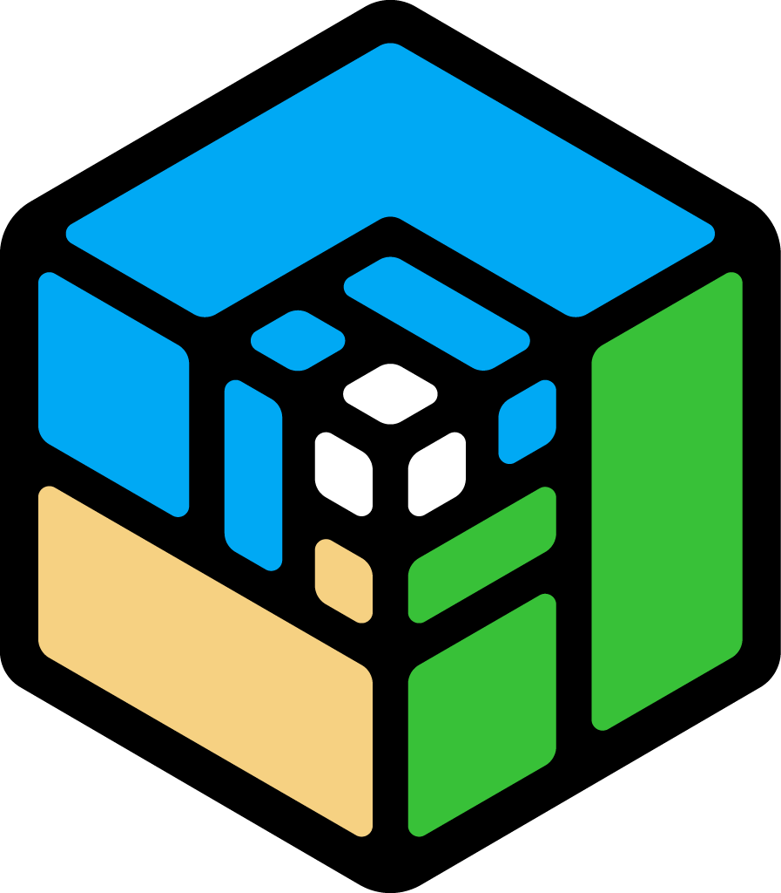
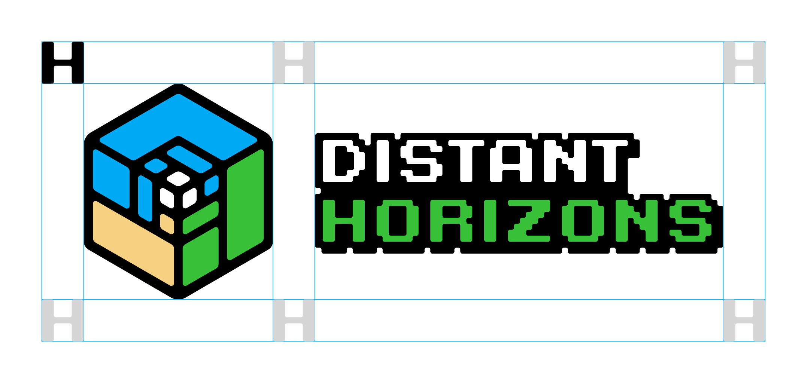
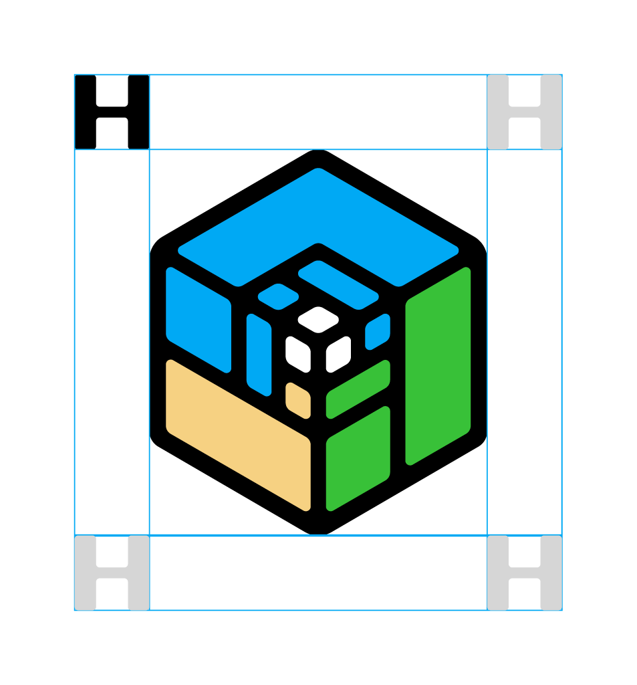

# Distant Horizons brand guidelines

To keep our look consistent and recognizable, we’ve created some simple guidelines for using our logos. We have a Primary logo, Core and API logos. Keep them cool 😎

## Logos
Please do not edit, change, distort, recolour, or reconfigure our logos.
|  |  |  |
|--|--|--|
|Primary &nbsp; &nbsp; &nbsp; &nbsp; [.png](/PNG/Distant-Horizons.png) &nbsp; &nbsp; &nbsp; &nbsp;  [.svg](./SVG/Distant-Horizons-Logo.svg)| Core &nbsp; &nbsp; &nbsp; &nbsp; [.png](/PNG/Distant-Horizons-Core.png) &nbsp; &nbsp; &nbsp; &nbsp;  [.svg](./SVG/Distant-Horizons-Core.svg) | API &nbsp; &nbsp; &nbsp; &nbsp;  [.png](./PNG/Distant-Horizons-API.png) &nbsp; &nbsp; &nbsp; &nbsp;  [.svg](./SVG/Distant-Horizons-API.svg) |

## Marks
Use these only when the Distant Horizons brand is clearly visible or has been well established elsewhere on the page or in the design. (When in doubt, use the other ones.)

> *Keep in mind the Distant Horizons API mark needs to be optically centered to align.*

<!-- |  |  |  |
|--|--|--|
|Primary &nbsp; &nbsp; &nbsp; &nbsp; [.png](/PNG/Distant-Horizons-Mark.png.png) &nbsp; &nbsp; &nbsp; &nbsp;  [.svg](./SVG/Distant-Horizons-Mark.svg.svg)| Core &nbsp; &nbsp; &nbsp; &nbsp; [.png](/PNG/Distant-Horizons-Core-Mark.png.png) &nbsp; &nbsp; &nbsp; &nbsp;  [.svg](./SVG/Distant-Horizons-Core-Mark.svg.svg) | API &nbsp; &nbsp; &nbsp; &nbsp;  [.png](./PNG/Distant-Horizons-API-Mark.png.png) &nbsp; &nbsp; &nbsp; &nbsp;  [.svg](./SVG/Distant-Horizons-API-Mark.svg.svg) | -->

|  |  |  |
|--|--|--|
|Primary &nbsp; &nbsp; &nbsp; &nbsp; [.png](/PNG/Distant-Horizons-Mark.png.png) &nbsp; &nbsp; &nbsp; &nbsp;  [.svg](./SVG/Distant-Horizons-Mark.svg.svg)| Core &nbsp; &nbsp; &nbsp; &nbsp; [.png](/PNG/Distant-Horizons-Core-Mark.png.png) &nbsp; &nbsp; &nbsp; &nbsp;  [.svg](./SVG/Distant-Horizons-Core-Mark.svg.svg) | API &nbsp; &nbsp; &nbsp; &nbsp;  [.png](./PNG/Distant-Horizons-API-Mark.png.png) &nbsp; &nbsp; &nbsp; &nbsp;  [.svg](./SVG/Distant-Horizons-API-Mark.svg.svg) |

## Spacing
Every logo needs room to breathe. 
Ours needs the free space of the height and width of the letter **"H"** in Distant **H**orizons.

> *Some leeway is allowed for the Distant Horizons API mark due to it's shape.*

|  |  |  
|--|--|

___

The logotype we are using in our logos is a modified [Karmatic Arcade font by Vic Fieger](https://www.dafont.com/karmatic-arcade.font?fpp=100&psize=s)

This branding guideline was influenced by [Discord's own](https://discord.com/branding)

Distant Horizons logos © 2024 by Pankakes are licensed under CC BY-SA 4.0 